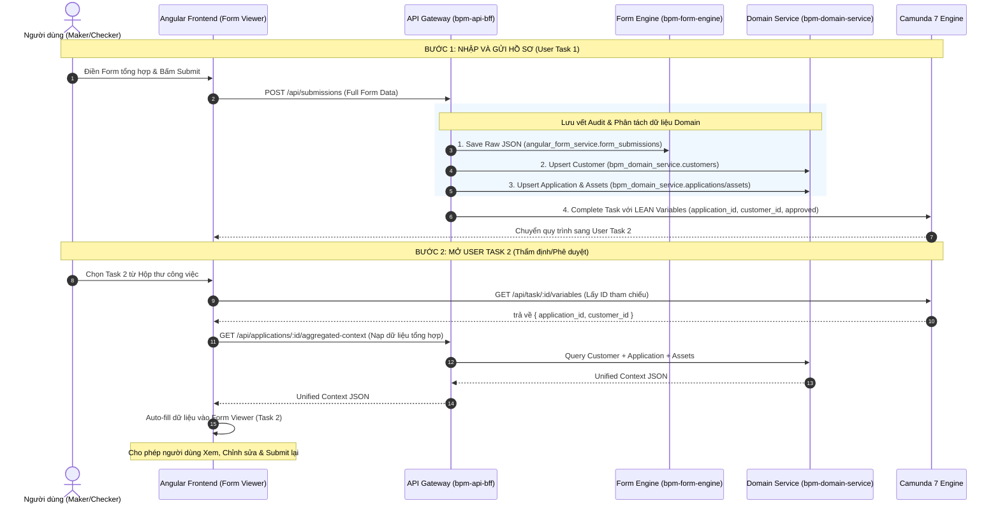

# Giải Pháp Kiến Trúc: Phân Tách & Nạp Dữ Liệu Đa Domain Cho Camunda Workflow

Tài liệu này trình bày chi tiết bài toán kiến trúc **Multi-Domain Data Aggregation & Hydration Pattern** giải quyết việc lưu trữ, phân tách dữ liệu đa miền nghiệp vụ (Customer, Application, Asset, Checklist), và nạp lại toàn bộ dữ liệu này xuyên suốt các User Task trong quy trình Camunda 7.

---

## 🎯 1. Nguyên Tắc Cốt Lõi (Core Architectural Principles)



### Các nguyên tắc phân định:
1. **Camunda Engine ONLY stores Lean Process References**:
   - Camunda CSDL (`camunda-service`) **chỉ lưu trữ các ID tham chiếu siêu nhẹ**:
     `{ application_id: "app_123", customer_id: "cust_456", approved: true }`.
   - **Tác dụng**: Giúp Camunda Engine chạy siêu nhanh, dung lượng database nhỏ gọn, không bị phình to do lưu JSON payload lớn.

2. **Form Engine stores Raw Audit Submissions**:
   - `angular_form_service.form_submissions` lưu trữ snapshot nguyên bản (Raw Audit Log) của từng lượt bấm Submit:
     `{ submission_id, form_key, task_id, process_instance_id, submitted_data }`.

3. **Domain Service stores Normalized Master Entities**:
   - `bpm_domain_service` lưu trữ dữ liệu chuẩn hóa của từng domain (`customers`, `applications`, `assets`, `checklists`) hỗ trợ truy vấn, báo cáo và tái sử dụng.

---

## 🏗️ 2. Mô Hình Dữ Liệu & Quy Trình Xử Lý Chi Tiết

### A. Quy Trình Gửi Form & Phân Tách Dữ Liệu (Submission & Dispatching Flow)

Khi người dùng hoàn thành Task 1 và gửi Form:

1. **Client Payload**:
   ```json
   {
     "taskId": "task_1102938",
     "processInstanceId": "proc_882910",
     "formKey": "form_create_application",
     "data": {
       "customer_id": "cust_001",
       "full_name": "Nguyễn Văn A",
       "phone": "0912345678",
       "id_card": "012345678901",
       "application_id": "app_2026_001",
       "loan_amount": 500000000,
       "loan_tenor": 24,
       "loan_purpose": "Vay mua nhà",
       "assets": [
         { "asset_type": "REAL_ESTATE", "asset_value": 800000000, "address": "Hà Nội" }
       ]
     }
   }
   ```

2. **BFF Gateway Routing (`bpm-api-bff/src/index.ts`)**:
   Khi nhận được request `POST /api/submissions`:
   - **Bước 1**: Gửi `data` nguyên bản sang `bpm-form-engine` để lưu vào `form_submissions`.
   - **Bước 2**: Tách khối dữ liệu Khách hàng -> Gọi `POST /api/customers/upsert` sang `bpm-domain-service` để lưu/cập nhật bảng `customers`.
   - **Bước 3**: Tách khối dữ liệu Hồ sơ vay -> Gọi `POST /api/applications/upsert` sang `bpm-domain-service` để lưu/cập nhật bảng `applications` và `assets`.
   - **Bước 4**: Trích xuất các biến Lean:
     ```typescript
     const camundaVariables = {
       application_id: { value: data.application_id || generatedAppId },
       customer_id: { value: data.customer_id || generatedCustId },
       approved: { value: data.approved !== undefined ? data.approved : true }
     };
     ```
   - **Bước 5**: Gọi `Camunda Engine` để hoàn thành task (`POST /api/task/:id/complete`).

---

### B. Quy Trình Nạp Lại Dữ Liệu Cho User Task Tiếp Theo (Data Hydration Flow)

Khi người dùng mở User Task 2 (ví dụ "Thẩm định hồ sơ"):

1. **BFF Gateway cung cấp Endpoint Nạp Tổng Hợp (Aggregated Context)**:
   `GET /api/applications/:id/aggregated-context` hoặc `GET /api/tasks/:id/hydration-data`.

2. **Tổ hợp Dữ liệu từ Domain Service**:
   Endpoint này sẽ tự động ghép dữ liệu từ `customers`, `applications`, và `assets` thành một đối tượng Flat/Structured JSON:
   ```json
   {
     "customer_id": "cust_001",
     "full_name": "Nguyễn Văn A",
     "phone": "0912345678",
     "id_card": "012345678901",
     "application_id": "app_2026_001",
     "loan_amount": 500000000,
     "loan_tenor": 24,
     "loan_purpose": "Vay mua nhà",
     "status": "SUBMITTED",
     "assets": [
       { "asset_type": "REAL_ESTATE", "asset_value": 800000000, "address": "Hà Nội" }
     ]
   }
   ```

3. **Angular Form Viewer Auto-Fill**:
   Khi `TaskExecutionComponent` tải Form của Task 2:
   - Đọc `processVariables` của Task -> lấy `application_id`.
   - Gọi `GET /api/applications/:application_id/aggregated-context`.
   - Truyền dữ liệu nhận được vào `FormViewerComponent` làm `initialValues`.
   - `FormViewerComponent.initializeControls` tự động gắn giá trị cho tất cả các trường input (`full_name`, `loan_amount`, `assets` grid, v.v.).
   - Cho phép người dùng Thẩm định xem, sửa đổi số tiền vay/điều kiện, và bấm Approve/Reject để gửi tiếp!

---

## 📋 3. Các Thay Đổi Cần Triển Khai Trong Mã Nguồn

### A. Endpoint Mới Tại Domain Service (`bpm-domain-service`)
- `POST /applications/upsert`: Tự động Insert/Update `applications` & `assets` theo `application_id`.
- `POST /customers/upsert`: Tự động Insert/Update `customers` theo `customer_id` hoặc `id_card`.
- `GET /applications/:id/aggregated-context`: Truy vấn JOIN thông tin Khách hàng, Hồ sơ vay và Danh sách Tài sản bảo đảm thành 1 JSON tổng hợp.

### B. Xử Lý Điều Hướng Tại BFF Gateway (`bpm-api-bff`)
- Nâng cấp API `POST /api/submissions`:
  1. Lưu vào Form Engine.
  2. Phân tách và Upsert vào Domain Service.
  3. Complete Camunda Task với Lean Variables.
- Thêm route proxy `GET /api/applications/:id/aggregated-context`.

### C. Nâng Cấp Client Frontend (`TaskExecutionComponent` & `FormViewerComponent`)
- Tự động gọi API `aggregated-context` khi mở Task có chứa `application_id` trong process variables.
- Nạp giá trị tự động vào Form Viewer cho người dùng duyệt hoặc điều chỉnh dữ liệu.

---

## 🧪 4. Kế Hoạch Kiểm Thử (Verification Plan)

### Automated Tests / Verification Commands
1. **Kiểm tra API Domain Upsert & Aggregated Context**:
   `cURL` hoặc `Postman` gọi `POST /api/applications/upsert` và `GET /api/applications/:id/aggregated-context`.
2. **Kiểm tra Complete Task**:
   Thực thi Task 1 -> Kiểm tra CSDL Postgres xem dữ liệu đã được lưu chuẩn xác vào cả 3 bảng `form_submissions`, `customers`, và `applications`.
3. **Kiểm tra Task 2 Data Hydration**:
   Mở Task 2 trên Angular UI -> Kiểm tra Form Viewer đã tự động lấp đầy dữ liệu từ Task 1 và cho phép sửa/lưu tiếp.
